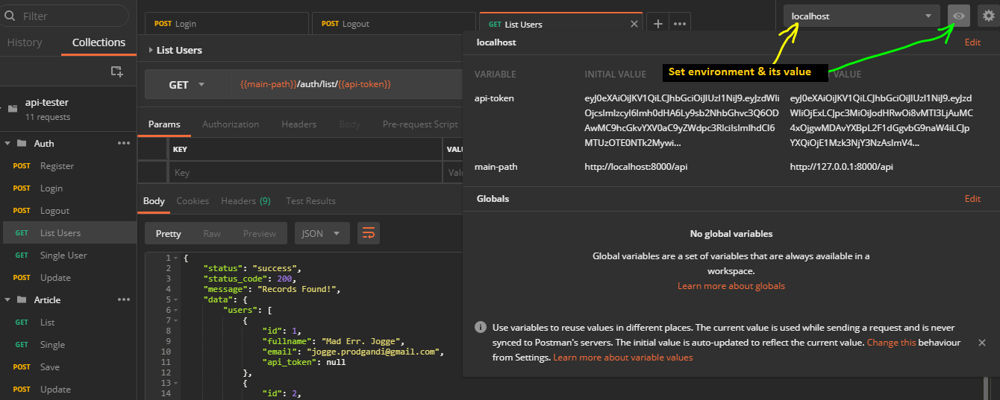

## Salam,

About this project : using mySql & laravel. Laravel has the most extensive and thorough [documentation](https://laravel.com/docs) and video tutorial library of any modern web application framework, making it a breeze to get started learning the framework.

This api it self still on development but stable to test on postman. [Click here](https://drive.google.com/open?id=1ZOW44XrxHNL09aNO19GBzMkIVWKEFv5p) to download the postman collection. Using that postman collection would be easier if you also set the environment, in case later you'll have several server or to just cope with repetitive declaration. 

You could set it like this:
 

## How to Implement

- Make sure composer is installed on your machine
- [on terminal] Go to your project directory
- [on terminal] Type "composer update", it will installing packages & create the autoload.php that require to run the program
- Remember to migrate the db, if fail, do it manually
- Your mysql service (could be included in XAMPP/WAMP etc) should be runnin at backside
- Rename '.env.example' file to '.env'. Match values inside the file with what you define on your own database
- [on terminal] Then type "php artisan serve"
- DONE

